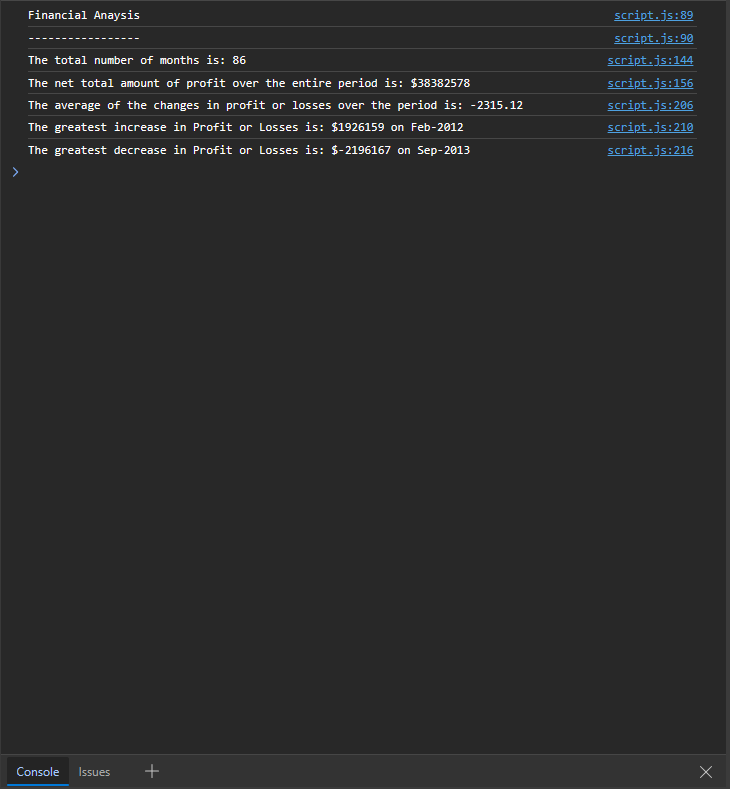

# Console-Finances

Overview
This project involves analyzing financial records using JavaScript. The dataset, located in the starter/index.js file, consists of arrays with two fields: Date and Profit/Losses. The goal is to write JavaScript code that performs the following analyses:

Total Number of Months:
Calculate the total number of months included in the dataset.

Net Total Amount of Profit/Losses:
Calculate the net total amount of Profit/Losses over the entire period.

Average Change in Profit/Losses:
Calculate the average of the changes in Profit/Losses over the entire period. Track the total change in Profit/Losses from month to month and then find the average. (Total/(Number of months - 1))

Greatest Increase in Profit/Losses:
Identify the month with the greatest increase in Profit/Losses and display both the date and the amount.

Greatest Decrease in Profit/Losses:
Identify the month with the greatest decrease in Profit/Losses and display both the date and the amount.

Instructions
Follow these steps to set up and run the project:

Create GitHub Repository:
Create a new GitHub repo called Console-Finances.

Clone Repository:
Clone the newly created repository to your computer.

Copy Starter Files:
Copy the starter files provided in the starter directory to your local git repository.

Run the Code:
Execute the JavaScript code in a browser or a Node.js environment. The resulting analysis will be displayed in the console.

Sample Output

After running the code, your console output should resemble the following:

## Financial Analysis

-Total Months: 86

-Total: $38382578

-Average Change: -2315.12

-Greatest Increase in Profits/Losses: Feb-2012 ($1926159)

-Greatest Decrease in Profits/Losses: Sep-2013 ($-2196167)

Ensure that the output matches the expected format and values.

The deploayed application is available at the following URL: <https://miriamcristinaz.github.io/Console-Finances/>

Feel free to modify the code to enhance functionality or improve readability. Happy coding!
